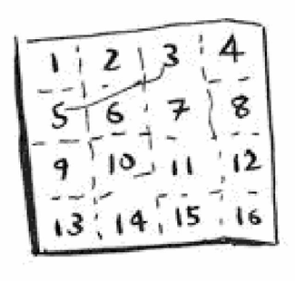
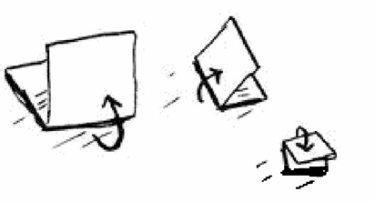
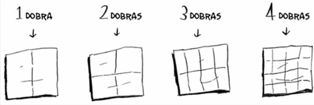
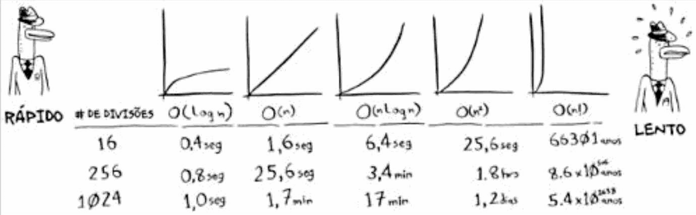

# Notação Big O

A Notação Big O é uma notação especial que diz o quão rápido é um algoritmo.

| Métrica                 | Pesquisa Simples | Pesquisa Binária |
|:------------------------|:-----------------|:-----------------|
| **100 itens**           | 100 ms           | 7 ms             |
| **1000 itens**          | 10 s             | 14 ms            |
| **1.000.000.000 itens** | 11 dias        n | 32 ms            |

---

## Uso da Notação

A notação **Big O** conta o número de operações.

> **Qual é um bom algoritmo para desenhar essa grade?**

### Algoritmo 1

Uma forma de desenhar essa grade de 16 divisões é desenhar uma divisão de cada vez. Você precisa desenhar 16 divisões.
Quantas operações você terá de fazer se desenhar uma divisão por vez?

> Desenhando a grade executando uma divisão por vez.

Qual é o tempo de execução desse algoritmo?  
$$ O(n) $$

### Algoritmo 2

Dobrar o papel uma vez é uma operação. Você fez
duas divisões com essa operação!

Dobre o papel de novo, de novo e de novo.

Desdobre depois de quatro dobras e você terá uma bela grade! A cada
dobra, o número de divisões duplica. Você fez 16 divisões com 4 operações

> Desenhando uma grade com quatro dobras.

$$O\lfloor \log_2 n \rfloor$$

---

## Principais Tempos de Execução Big O

| Tempo de Execução             | Notação Big O                          |
|:------------------------------|:---------------------------------------|
| Tempo logarítmico             | $$O(\lfloor \ log \  n \rfloor\ + 1)$$ |
| Tempo linear                  | $$O(n)$$                               |
| Algoritmo rápido de ordenação | $$O(n \log n)$$                        |
| Algoritmo lento de ordenação  | $$O(n^2)$$                             |
| Algoritmo bastante lento      | $$O(n!)$$                              |

---

> A notação Big O é usada para estabelecer o tempo de execução para a pior hipótese