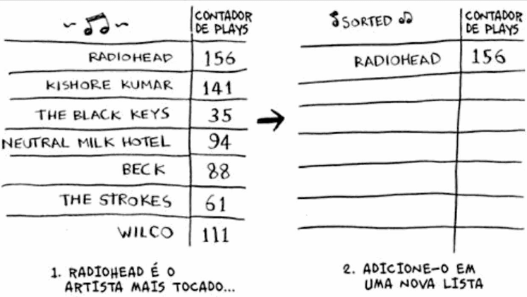
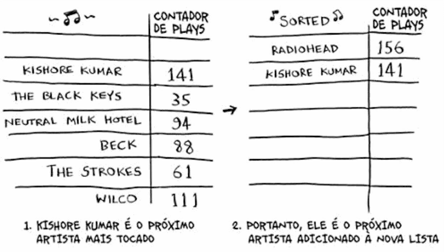
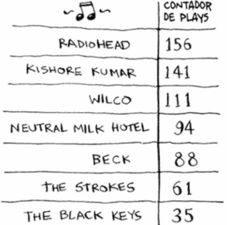

# Ordenação por Seleção

Ordenar a lista do artista mais tocado para o menos tocado.

Pegar o artista mais tocado da lista de músicas e adicioná-lo a uma nova lista.

> Faça isso de novo para encontrar o próximo artista mais tocado.

> Continue fazendo isso e então você terminará com uma lista ordenada.

---

## Tempo de Execução

Para encontrar o artista com o maior número de plays, você precisa verificar cada item da lista.
Isso tem tempo de execução **O(n)**.

Como essa é uma operação com tempo de execução *O(n)* e você precisa repetir essa operação *n* vezes, o resultado é:

$$O(n \cdot n) \text{ ou } O(n^2)$$

---

> A ordenação por seleção é um algoritmo bom, mas não é muito rápido.
>
> O **Quicksort** é um algoritmo de ordenação mais rápido — $O(n \log n)$.