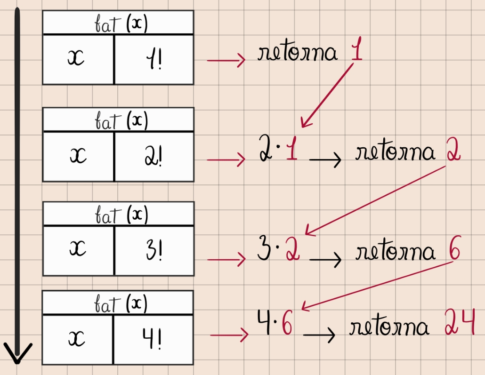

# Recursão em Python — Função Fatorial

## O código

```python
# Função recursiva - Fatorial
def fat(x):
    if x == 1:
        return 1
    else:
        return x * fat(x - 1)

resultado = fat(4)
print()
print(f"Resultado: {resultado}")
input("Aperte Enter")
```

Arquivo [aqui](../codigo/fat.py)

---

## O que é recursão?

Recursão é quando uma função **chama a si mesma** para resolver um problema menor,
até chegar em um caso simples o suficiente para ser resolvido diretamente — o chamado
**caso base**. Toda função recursiva bem escrita precisa de dois elementos:

1. **Caso base** — a condição que interrompe as chamadas (`if x == 1: return 1`)
2. **Caso recursivo** — a chamada da função a si mesma com um valor "mais próximo" do caso base (`x * fat(x - 1)`)

Sem o caso base, a função chamaria a si mesma infinitamente, até estourar a pilha de chamadas
(`RecursionError`).

---

## Analisando a função `fat(x)`

```python
def fat(x):
    if x == 1:
        return 1
    else:
        return x * fat(x - 1)
```

- Se `x` for igual a `1`, a função retorna `1` diretamente (caso base).
- Caso contrário, ela retorna `x` multiplicado pelo resultado de `fat(x - 1)` — ou seja,
  ela **precisa esperar** o resultado da chamada seguinte antes de conseguir calcular o seu próprio retorno.

Isso é a essência da recursão: cada chamada **empilha** uma nova execução pendente,
esperando o resultado da próxima, até que o caso base finalmente devolva um valor
e a pilha comece a ser "desempilhada".

---

## Fluxo de chamadas (descendo a pilha)

Ao chamar `fat(4)`, o Python começa a empilhar chamadas sucessivas, pois cada uma depende
do resultado da próxima:



```
fat(4)
 └── 4 * fat(3)
      └── 3 * fat(2)
           └── 2 * fat(1)
                └── caso base: retorna 1
```

Repare que **nenhuma multiplicação é executada ainda** nesse momento — cada chamada está
"pausada", esperando o valor de retorno da chamada seguinte. É como empilhar pratos:
você só pode tirar o de cima depois que ele foi colocado por último.

---

## Fluxo de retorno (subindo a pilha)

Quando `fat(1)` retorna `1`, a pilha começa a ser desfeita **de trás para frente** —
cada chamada pendente finalmente consegue calcular sua multiplicação e devolver o resultado
para quem a chamou:

```
fat(1) retorna 1
fat(2) retorna 2 * 1 = 2
fat(3) retorna 3 * 2 = 6
fat(4) retorna 4 * 6 = 24
```

Esse é o ponto-chave da recursão: a função **desce** empilhando chamadas (sem calcular nada),
e só **calcula de fato** quando começa a subir de volta, retornando os valores em cascata
até o resultado final chegar na chamada original (`resultado = fat(4)` → `24`).

<!-- ESPAÇO PARA O DESENHO DO FLUXO DE CHAMADAS E RETORNOS -->


<!-- LINK PARA O ARQUIVO DO CÓDIGO -->


---

## Resumo do fluxo completo

| Etapa | Chamada | Ação |
|-------|---------|------|
| 1 | `fat(4)` | chama `fat(3)`, aguarda |
| 2 | `fat(3)` | chama `fat(2)`, aguarda |
| 3 | `fat(2)` | chama `fat(1)`, aguarda |
| 4 | `fat(1)` | caso base → retorna `1` |
| 5 | `fat(2)` | recebe `1`, retorna `2 * 1 = 2` |
| 6 | `fat(3)` | recebe `2`, retorna `3 * 2 = 6` |
| 7 | `fat(4)` | recebe `6`, retorna `4 * 6 = 24` |

O resultado final, `24`, é armazenado na variável `resultado` e depois exibido com:

```python
print(f"Resultado: {resultado}")
```