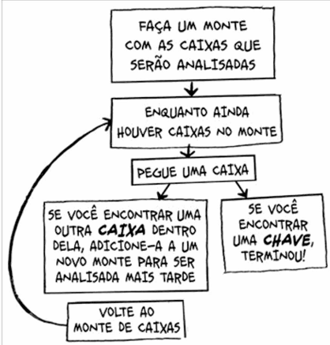
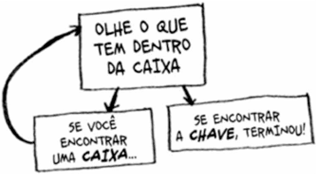

# Recursão

> **Recursão não é um algoritmo, é uma técnica de programação.**

A recursão ocorre quando uma função **chama a si mesma** durante sua execução.

> ⚠️ **Nota:** Não há nenhum benefício quanto ao **desempenho** ao utilizar a recursão em comparação com abordagens iterativas (como laços `for` ou `while`). Em muitos casos, a abordagem iterativa pode ser mais eficiente em termos de memória. No entanto, a recursão torna o código significativamente mais limpo e legível ao lidar com problemas complexos.

---

## Comparativo de Fluxo

### 1. Abordagem Iterativa

### 2. Abordagem Recursiva

---

## Principais Destaques

* **Uso Amplo:** Muitos algoritmos clássicos (como *Quicksort*, *Merge Sort* e travessia de árvores) utilizam a recursão.
* **Caso Base:** Toda função recursiva precisa de uma condição de parada (*caso base*) para evitar execução infinita e o estouro da pilha de memória (*stack overflow*).