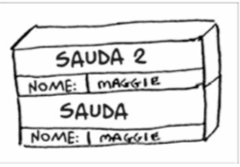

# 3.1 Suponha que eu forneça uma pilha de chamada como esta:

> Quais informações você pode retirar baseando-se apenas nesta pilha de chamada?

### R: **Função Principal:** ``sauda`` --> variável ``nome = Maggie``
### R: **Estado de Execução:** ``sauda`` está pausada
### R: **Função Atual:** ``sauda2`` --> variável ``nome = Maggie``
### R: **Topo da pilha:** ``sauda2`` é a que está em execução no momento.
### R: **Ordem de Retorno:** Quando a função ``sauda2`` terminar de ser executada, ela será removida do topo da pilha e o controle voltará para a funçao ``sauda``.